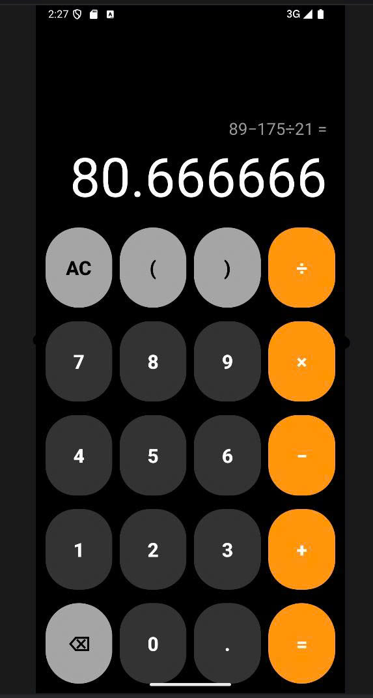
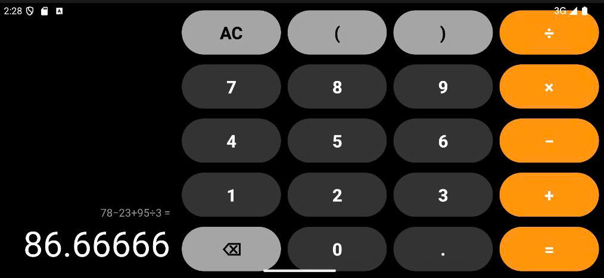

# Group 03 — MOPR (Mobile Programming)

Welcome to the repository for **Group 03**'s Mobile Programming (MOPR) projects.  
This repo contains Android applications built with **Java** and **Android Studio**.

---

## Team Members

| Name | Student ID |
|------|------|
| Huynh Gia Han | 23110019 |
| Bui Tran Tan Phat | 23110052 |
| Nguyen Nhat Phat | 23110053 |

---

## Projects

### Calculator

A clean, iPhone-style calculator app for Android built with Java.

**Features:**
- Basic arithmetic: addition, subtraction, multiplication, division
- Parentheses support for complex expressions
- Correct operator precedence (× ÷ before + −)
- Expression display with result shown only after pressing `=`
- Delete and clear (AC) buttons
- Responsive layout for both portrait and landscape orientations

**Tech stack:** Java · Android Studio · XML Layouts · Recursive Descent Parser

---

## Screenshots

<p align="center">
  
  &nbsp;&nbsp;&nbsp;&nbsp;
  
</p>

<p align="center">
  <em>Portrait mode &nbsp;&nbsp;&nbsp;&nbsp;&nbsp;&nbsp;&nbsp;&nbsp;&nbsp;&nbsp;&nbsp;&nbsp;&nbsp;&nbsp;&nbsp;&nbsp;&nbsp;&nbsp;&nbsp;&nbsp;&nbsp;&nbsp;&nbsp;&nbsp;&nbsp;&nbsp;&nbsp;&nbsp; Landscape mode</em>
</p>

---

## Getting Started

### Prerequisites
- Android Studio (latest stable)
- Android SDK API 21+
- A physical device or emulator running Android 5.0+

### Clone & Run

```bash
git clone https://github.com/FlynnBui399/MOPR-NHOM03.git
```

1. Open **Android Studio**
2. Click **Open** → select the `Calculator` folder inside the cloned repo
3. Wait for **Gradle sync** to finish
4. Click **Run ▶** or press `Shift + F10`

---

## Repository Structure

```
MOPR-NHOM03/
└── Calculator/
    ├── app/
    │   ├── src/main/
    │   │   ├── java/com/example/calculator/
    │   │   │   └── MainActivity.java
    │   │   └── res/
    │   │       ├── layout/
    │   │       │   ├── activity_main.xml         # Portrait layout
    │   │       ├── layout-land/
    │   │       │   └── activity_main.xml         # Landscape layout
    │   │       ├── drawable/                     # Button styles
    │   │       └── values/                       # Colors, themes
    │   └── build.gradle
    └── build.gradle
```

---

## License

This project is for educational purposes as part of the Mobile Programming course.
